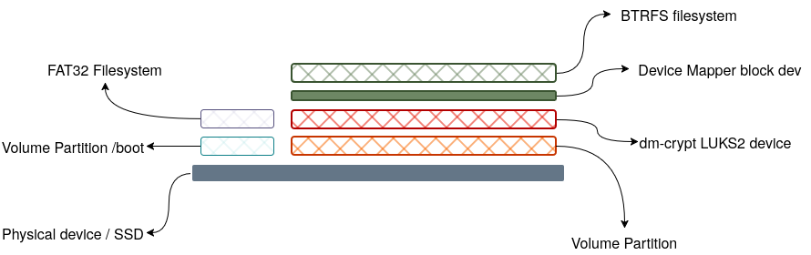

# Background

I am annoyed that I can't use multiple kernels or build Unified Kernel Images (UKI) because my boot partition is too small to hold stuff. I now have to undertake a risky resize operation which is made complex by the fact that there are different layers of stuff I need to carefully consider to avoid data loss.



## Peeling the onion

### BTRFS

Resizing btrfs filesystem "should" be straightforward.

```bash
sudo btrfs filesystem resize -512M /
```

### LUKS device

Refer manpage for cryptsetup resize `man 8 cryptsetup-resize`

```bash
➜  sudo cryptsetup status crypted
[sudo] password for user: 
/dev/mapper/crypted is active and is in use.
  type:    LUKS2
  cipher:  aes-xts-plain64
  keysize: 512 [bits]
  key location: keyring
  device:  /dev/sda2
  sector size:  4096 [bytes]
  offset:  32768 [512-byte units] (16777216 [bytes])
  size:    1952440320 [512-byte units] (999649443840 [bytes])
  mode:    read/write
  flags:   discards

# We need to recover 1048576 * 512 Bytes == 512 MiB.
cryptsetup resize --size 1950000000  # Gives us 929.8 GiB
```

### Partition resize
TBD
