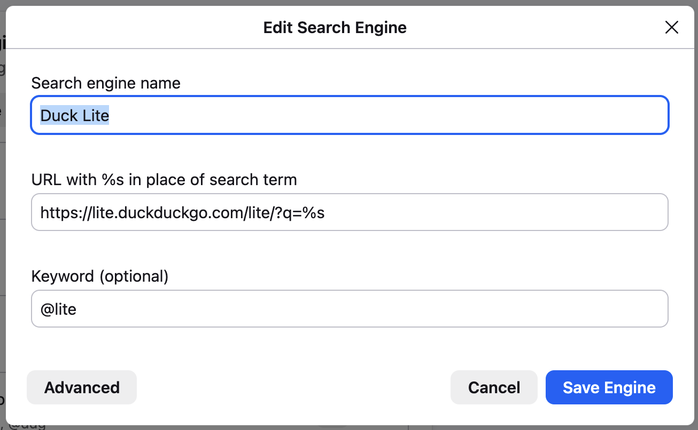

# Firefox Customisation

## Default search engine

We can set as the default search engine, DuckDuckGo Lite which is a javascript-light(?) version of DuckDuckGo. 

1. Go to search settings page - `about:preferences#search`
2. Add a new search engine entry with URL `https://lite.duckduckgo.com/lite/?q=%s` and a keyword (eg. `@lite`)
3. Set as default and disable others

